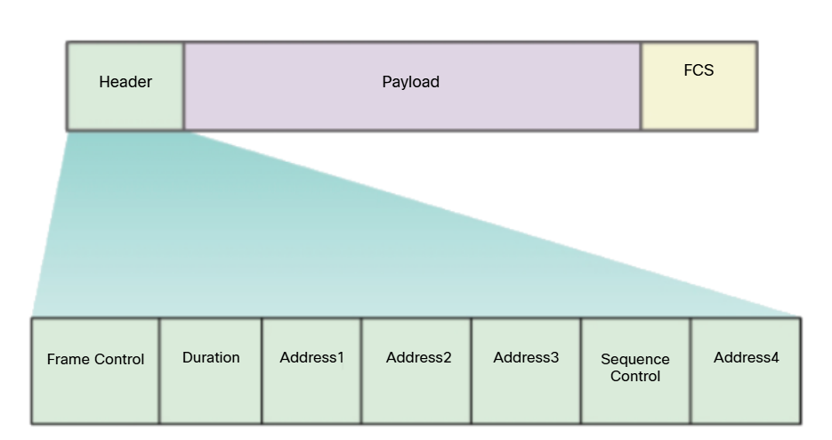

# Infrastructure Mode

Access Point (AP) ya da wireless router gibi cihazların, wired distribution yani kablolu dağıtım sistemine bağlanarak, wireless cihazlara hizmet vermesidir. AP veya wireless router gibi cihazlar, dijital verileri radyo sinyalleriyle iletmek için modülasyon teknikleri kullanır ve kablosuz iletişimi bu şekilde sağlar.

#### NOT: AP/Wireless router gibi cihazlar, dijital sinyalleri analog sinyallere dönüştürmezler. Sadece dijital veriyi radyo frekansları üzerinden taşınabilecek hale getirmek için modülasyon teknikleri kullanırlar. Dijital sinyalleri, analog sinyale dönüştürme işlemini, telefon hatlarıyla çalışan eski ADSL modemler gerçekleştirir. Günümüz modemleri de modülasyon sistemini kullanmaktadır.

# Ad Hoc Mode

İki wireless cihaz arasındaki P2P bağlantıdır. Burada herhangi bir AP veya wireless router yoktur. İki tane telefonun bluetooth iletişimi örnek gösterilebilir. Ad Hoc, kavramsal olarak "gerektiğinde, ihtiyaç olunduğunda" gibi anlamlara gelir. Böyle denmesinin sebebi, bağlantının anlık bir ihtiyaç için kurulması ve geçici bir çözüm sunmasıdır.

# Tethering

Wireless bir cihazın, diğer cihazlara hücresel veri ile internet sağlamasıdır. Bu esnada wireless cihazın bir AP gibi davranır ve bu yüzden de "hotspot" adını alır. Wi-Fi, Bluetooth gibi yöntemlerle oluşturulabileceği gibi USB gibi yöntemlerle de diğer cihazlara internet aktarılabilir.

# BSA (Basic Service Area)

Bu, bir AP'nin veya wireless routerin kapsama alanıdır (Örneğin, router’ın Wi-Fi sinyali nereye ulaşıyorsa orası BSA’dır). Bu kapsama alanına birden fazla kablosuz cihaz dahil olabilir. Bu alan AP'nin BSSID'si ile tanımlanır. 

# BSSID (Basic Service Set Identifier)

Wireless routerın veya AP'nin, Wi-Fi arayüzünün MAC adresini ifade eder.

# SSID (Service Set Identifier)

Wireless bir ağın ismini ifade eder. Telefonunuzda Wi-Fi kısmını açarsanız, göreceğiniz isimler aslında SSID'dir.

# ESA (Extended Service Area)

Birden fazla BSA'in birleşimi ile oluşur. Bu BSA'ler birbirine wired distribution sistemi ile bağlanır. Herhangi bir wireless cihaz, bir BSA'dan diğerine geçebilir yani roaming (dolaşma) yapabilir ve bunu yaparken de bağlantısı kopmaz. Kampüs veya havaalanı gibi büyük Wi-Fi ağları örnek gösterilebilir.

# 802.11 Frame Structure

Normalde, "Ethernet" kavramı wired iletişimle ilgili olsa da 802.11 (Wi-Fi) standartına göre büyük ölçüde 802.3 (Ethernet for wired LANs) standartındaki ethernet frame yapısını temel alması nedeniyle "Wireless Ethernet" veya "Ethernet for WLANs" şeklinde ifade edildiği görülebilir. 

Wi-Fi (802.11) frame'i, Ethernet’ten daha karmaşıktır çünkü kablosuz iletişimde kontrol ve güvenlik daha çok ön plandadır.

## Frame Control

Wireless frame türünü tanımlar ve protocol version, frame type, address type, power management, security settings gibi subfields içerir.

## Duration

Bu genellikle bir sonraki frame iletimini almak için gereken kalan süreyi belirtmek için kullanılır.

## Address 1

Alıcı wireless cihazının ya da AP'nin MAC adresini içerir.

## Address 2

Gönderici (kaynak) wireless cihazının ya da AP'nin MAC adresini içerir.

## Address 3

Adres 1 ve 2 fiziksel iletim için kullanılırken, adres 3 mantıksal (logical) hedef/kaynak ya da BSSID için kullanılır. Bu aslında, ethernet'teki Layer 2 MAC adresleriyle Layer 3 IP adreslerinin ilişkisine benzer. Adres 3, paketin asıl hedefi ya da ağın kimliğini ifade eder.

## Sequence Control

Fragment number ve sequence number'ları içerir. Fragment numarası, parçalanmış paketlerin numarasını ve sequence numarası, paket sıralamasını (Örn; TCP için) içerir.

## Address 4

Opsiyoneldir, sadece WDS (Wireless Distribution System), mesh, bridge gibi durumlarda kullanılır. Yani aslında ek yön bilgisi için kullanılır diyebiliriz.

## FCS

Layer 2 hata kontrolü için kullanılır.

# CSMA/CA (Carrier-sense multiple access with collision avoidance)

Ethernet ağlarında kullanılan eski sistemlerde (özellikle hub'lı yapılarda), bağlantılar half-duplex çalışır; yani cihazlar aynı anda hem veri gönderip hem veri alamaz. Ancak Ethernet’te, cihazlar veri gönderirken aynı anda kablodaki fiziksel sinyali dinleyebilir (veri almak değil, ortamı izlemek anlamında). Bu sayede başka bir cihaz da aynı anda veri göndermeye kalkarsa oluşan çarpışma (collision) fiziksel olarak algılanabilir. Bu mekanizma sayesinde Ethernet, CSMA/CD (Carrier Sense Multiple Access with Collision Detection) kullanır. Öte yandan, Wi-Fi (802.11) de half-duplex çalışır, fakat kablosuz cihazlar veri gönderirken ortamı dinleyemez; çünkü gönderilen güçlü radyo sinyali, cihazın kendi antenini adeta sağır eder. Bu yüzden Wi-Fi’da çarpışma algılamak mümkün değildir. Bunun yerine CSMA/CA (Collision Avoidance) kullanılır; cihazlar veri göndermeden önce ortamı dinler, boşsa gönderir, gerekiyorsa RTS/CTS mekanizmasıyla diğer cihazları uyarır. Yani Ethernet’te half-duplex olmasına rağmen ortamı dinleme (sinyal algılama) mümkün olduğu için çarpışma tespiti yapılabilirken, Wi-Fi'de bu fiziksel olarak mümkün olmadığından çarpışmayı önlemeye yönelik bir yöntem kullanılır.

#### NOT: Günümüzde modern Ethernet bağlantıları (örneğin switch'li ağlar), full-duplex çalışır; yani cihazlar aynı anda hem veri gönderip hem veri alabilir. Bu sayede çarpışma (collision) olasılığı fiziksel olarak ortadan kalkar. Dolayısıyla, eski hub tabanlı ağlarda kullanılan CSMA/CD (Collision Detection) protokolüne artık ihtiyaç yoktur ve güncel Ethernet iletişimlerinde hiçbir CSMA yöntemi kullanılmaz.

CSMA/CA wireless bir ağdaki verilerin nasıl ve ne zaman gönderileceğini belirler. Bunun aşamaları bir client üzerinden şu şekilde açıklanabilir:

1- Bir kanalın "idle" yani boş olduğunu doğrulamak için kanalı dinler. Bu, o kanalda başka bir trafik olup olmadığını belirlemeye yarar. Bu "channel" kavramı aynı zamanda "carrier" (taşıyıcı) olarak da adlandırılabilir.

2- AP'ye, ağa özel erişim talebinde bulunmak için "ready to send (RTS)" mesajı gönderir.

3- AP'den veriyi göndermek için izin almasına karşılık, "clear to send (CTS)" mesajı ile onay alır.

#### NOT: Eğer client, rastgele bir şekilde belirlediği süre içerisinde AP'den mesaj alamazsa, süreci tekrar başlatır.

4- CTS'i aldıktan sonra veriyi gönderir.

5- Veri gönderimi esnasında tüm iletimler onaylanır (acknowledged). Eğer wireless client bir onay mesajı almazsa, bir collision olduğunu varsayarak süreci yeniden başlatır.

#### NOT: Küçük frame'ler için RTS/CTS süreci atlanır, sadece ortam dinlerek ortam boşsa veri doğrudan gönderilir. Fakat frame büyükse bu aşamalardan geçmelidir. Yani RTS/CTS opsiyonel ve performansa göre optimize edilen bir sistemdir. Bu aşamalar ağa fazladan trafik ekleyeceğinden ve gecikme yaratacağından her zaman kullanılmaz.

# Wireless Client and AP Association

Wireless cihazların bir ağda iletişime geçebilmesi için öncelikle bir AP ya da wireless router ile ortaklaşması gerekir. Bu süreç, WLAN keşfi ile keşfedilen WLAN'e bağlanma şeklinde gerçekleşir. Bu bağlanma esnasında AP ile wireless cihaz belirli parametreler üzerinde anlaşmalıdır. Bu parametreler şu şekildedir:

## SSID

WLAN'lerin isimleridir. Bazı ağ yapılandırmaları dahilinde birden fazla AP, aynı SSID'yi paylaşabilir. 

## Password

Bir client AP ile "authenticate" sürecinden geçebilir. Bu işlem parola ile kimlik doğrulaması sağlar.

## Network Mode

Bu, 802.11a/b/g/n/ac/ad WLAN standartlarını içerir. AP veya wireless router, hangi standart ile yapılandırılmışsa, client da ancak o standartı destekliyorsa WLAN'e dahil olabilir. Bunun yanında AP veya wireless router'lar birden fazla standartı destekleyecek şekilde "Mixed Mode" ile de yapılandırılmış olabilir. Bu aynı anda farklı standartları destekleyen client'ların WLAN'e dahil olmasına olanak tanır.

## Security Mode

WEP, WPA ve WPA2 gibi şifreleme tiplerini içerir. 

## Channel Settings

İletim yapılırken kullanılacak kanalı (frekans bandını) ifade eder. Wireless routerlar ve AP'ler radyo frekans kanallarını tarayabilir ve uygun bir kanal ayarını otomatik olarak seçebilir. Ayrıca bu kanal, diğer wireless router veya AP'lerle parazit olması gibi bir durumda manuel olarak da ayarlanabilir.

# Passive and Active Discover Mode

Wireless bir client'ın, wireless routera ya da AP'ye bağlanması için onu keşfetmesi gerekir. Bu keşif iki şekilde gerçekleşebilir:

## Passive Mode

Bu modda AP; SSID'sini, desteklediği standartları ve güvenlik ayarlarını içeren broadcast beacon frame'lerini periyodik olarak clientlara yollar. Bu beacon frame'lerin amacı, kablosuz istemcilerin belirli bir alanda hangi ağların ve AP'lerin mevcut olduğunu öğrenmesini sağlamaktır. Böylece kablosuz istemci istediği AP'ye veya wireless router'a bağlanabilir.

## Active Mode

Bu modda wireless clientlar SSID'yi manuel olarak girebilir. Wireless clientlar birden fazla kanalda, probe request frame'lerini broadcast yaparak süreci başlatır. Bu probe request, SSID'yi ve desteklenilen standartları içerir. AP'ler veya wireless routerlar bu requeste yanıt olarak; SSID'lerini, destekledikleri standartları ve güvenlik ayarlarını içeren bir "probe response" ile gönderirler. Bu mod, eğer bir AP veya wireless router beacon frame'lerini broadcast yapmayacak şekilde yapılandırılmışsa gerekli olabilir. Wireless clientlar, yakındaki WLAN'leri keşfetmek için SSID adı olmadan da bir probe request gönderebilir. Yani SSID verirsen sadece onunla ilişkili AP veya wireless router'dan cevap alırsın ama SSID verilmezse o alan içerisinde kullanılabilir tüm wireless router veya AP'lerden cevap alırsın.

## AP, LWAP, WLC

Küçük ağlarda tek bir AP olabileceği gibi büyük ağlarda da birden fazla AP bulunabilir. Bu AP'ler tek bir merkezden yönetilerek daha basit yapılandırılabilir, yönetilebilir ve izlenebilir. AP'lerin merkezi hale gelmesi için "Wireless LAN Controller (WLC)" adı verilen cihaz kullanılır. AP'ler bir WLC'ye bağlandıklarında özerk bir şekilde davranamaz, ve bu konumda "Ligtweight AP'ler" olarak adlandırılırlar. LWAP'ler sadece wireless LAN ve WLC arasında veri iletebilir. Bununla beraber, SSID tanımlama ve authentication (kimlik doğrulama) gibi tüm yönetim işlemleri AP'lerin her birinde değil, merkezi WLC'de yürütülür.

## WLAN Security

Wireless sinyaller, o kapsama alanına dahil herkesin cihazına ulaşabildiğinden ötürü çeşitli güvenlik tehditlerini de beraberinde getirir. Bunun önüne geçmek için, wireless cihazlar arasındaki veriler şifrelenmeli ve kimlik doğrulama olmadan ağ kullanılamaz olmalıdır. Bunun haricinde Rogue AP'lerin önüne geçmek için de WLC gibi merkezi yönetim teknikleri kullanılmalı ve gerekli politikalar uygulanmalıdır.

Wireless cihazlarla beraber farklı ev aletleri (mikrodalga fırın, ev telefonu vs.) de çeşitli sinyaller yaydığından, aynı frekans bandını kullanan cihazlar arasında parazit oluşabilir. 2.4 GHz frekans bandını, 5 GHz bandına çekmek bir çözüm olabilir.

## SSID Cloaking and MAC Address Filtering

SSID Cloaking bazı AP ve wireless routerların, SSID beacon frame'leri göndermesini engeller. Böylece cihazlara SSID manuel olarak girilmediği sürece herhangi bir SSID bilgisi yayınlanmaz.

#### NOT: SSID Cloaking etkinken, AP'ler veya wireless routerlar tarafından hala beacon frame'leri gönderilmeye devam eder, sadece o frame'lerin içinde SSID bilgisi yer almaz.

SSID'nin yayınlanmıyor olması güvenliği arttırıyor gibi gözükse de aksine çok da kullanışlı olduğu söylenemez. SSID Cloaking etkin olmasına rağmen ağ hala tespit edilebilir durumdadır ve bu yüzden de bu yöntem günümüzde pek de bir işe yaramaz.

Bununla beraber bir network admini manuel olarak çeşitli MAC adreslerine izin verirken, bazı MAC adreslerini filtreleyebilir. Böylece kablosuz ağa sadece istenilen MAC adresine sahip cihazlar dahil olması sağlanabilir. Fakat günümüzde "MAC Address Spoofing" yani sahte bir MAC adresi oluşturmak diye bir yöntem olduğundan, bu yöntem de kullanışlı değildir.

Bunlar göz önünde bulundurulduğunda, wireless bir ağı korumak için daha kullanışlı yöntemlere ihtiyaç duyulur. Bunlar çeşitli authentication ve encryption sistemleridir. Çeşitli authentication yöntemlerine şöyle bir bakalım:

## Open System Authentication

Okul, kafe, hotel gibi public alanlarda, kablosuz ağa kolayca dahil olmak için herhangi bir kimlik doğrulama yöntemine başvurulmayabilir. Bu da çeşitli riskleri beraberinde getirdiğinden, zorunda kalmadıkça topluma açık kablosuz ağlara bağlanılmamalı, bağlanılmak zorunda kalınırsa da mutlaka iyi bir VPN tercih edilmelidir.

## Shared Key Authentication

Kablosuz bir istemci ile AP arasında verileri doğrulamak ve şifrelemek için WEP, WPA, WPA2 ve WPA3 gibi mekanizmalar sağlar. 

### Wired Equivalent Privacy (WEP)

WEP, "Rivest Cipher 4 (RC4)" encryption methodunu statik bir key ile kullanılır. Bu key, paketler değiş tokuş edildiğinde hiçbir zaman değişmez yani statiktir. Bu yüzden de kötü niyetli biri tarafından kolayca ele geçirildikten sonra yine kolayca kırılabilir. Nasıl bu kadar kolay kırılabilir olduğunu daha yakından inceleyelim:

WEP’in şifreleme algoritması şu şekilde çalışır:

RC4 = IV + Paylaşılan Anahtar (Shared Key)

RC4 şifreleme algoritması, şifreleme için IV (Initialization Vector yani Başlatma Vektörü) ile beraber Shared Key kullanarak paket paket şifreleme yapar. 

Kriptografide IV, her pakette kullanılan rastgele bir ek değer anlamına gelir. Bunun amacı, aynı anahtarla şifrelenen iki verinin farklı ciphertext (şifreli metin) üretmesini sağlamaktır. Dolayısıyla da her paketteki şifrelemenin farklı olması amaçlanır. Fakat WEP'te IV sadece 24 bittir. Bu da 2 üssü 24 = 16.777.216 tane farklı IV üretilmesi demektir. Sayı çok fazla gözükebilir fakat bu sayı özellikle de günümüz ağlarında oldukça hızlı tükenir. Bir ağda bilhassa çok fazla trafik varsa, IV'ler 1 saati bulmadan hızla tükenir. Daha sonrasında aynı IV'ler tekrardan kullanılmaya başlanır, bu da "IV reuse" olarak bilinir. Aslında özetle, kullanılan şifreleme yani IV'ler değişse bile bir yerden sonra tekrar etmeye başlar, ayrıca da bu şifreleme yötneminde kullanılan anahtar (shared key) daima sabit kalır.

IV'ler tekrar başa dönüp yeniden kullanılmaya başlandığında, aynı RC4 keystream elde edilir çünkü shared key'in sabit olduğunu söylemiştik. Yani aslında bir önceki sürecin aynısı bir daha başlar. Bu sürekli tekrarlayan döngü saldırganın, IV'leri toplayarak aynı IV'lerle şifrelenmiş verilerin arasındaki benzerlikleri analiz etmesine ve bununla beraber de shared key'i ortaya çıkarmasına olanak tanır.

