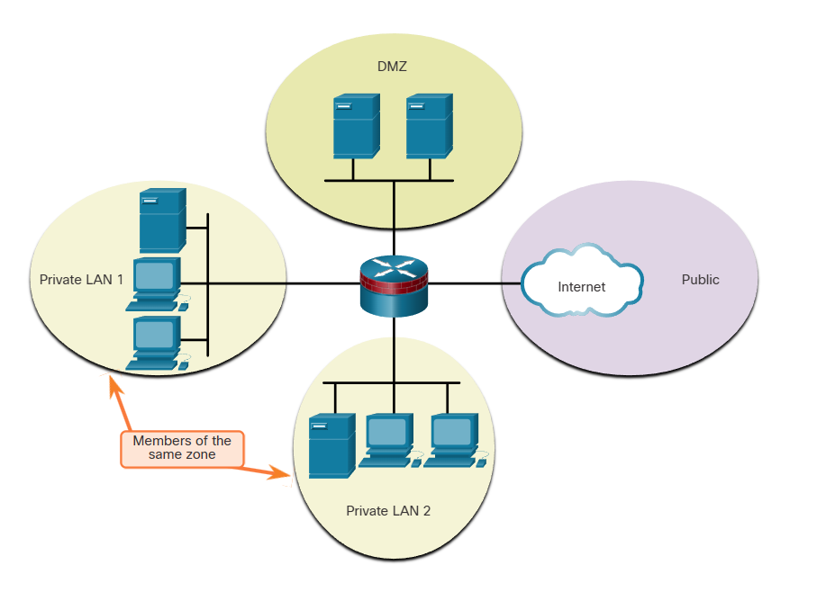

# Firewalls

Firewall, internal network ile external network arasına yerleştirilen ve aradaki ağ trafiğini denetleyen bir sistemdir. Firewall'lar access control politikasını uygular. Access control en basit haliyle; “kim, hangi kaynağa, hangi şartlar altında erişebilir?” sorusuna verilen cevaptır. Firewall'lar da, "Hangi IP adresleri içeri girebilir?", "Hangi portlardan trafik geçebilir?", "Hangi protokollere izin verilir? (HTTP, SSH, FTP vs.)" gibi sorulara cevap olarak yapılandırılır.

Bununla beraber firewall'lar, yanlış yapılandırıldığında ağda büyük problemlere yol açabilir. Örneğin, izin verilmesi gereken bir protokole izin verilmezse bağlantı sorunları meydana gelebilir. Firewall'lar gelen giden paketleri incelediğinden aynı zamanda ağda performans düşüşüne de sebep olabilir. Ayrıca yetkisiz trafik, meşru trafiğin içine sızarak firewall'lardan geçebilir.

## Firewall Designs

### Private and Public Firewalls

Bu tasarımda public network dış ağ, private network iç ağ olarak kabul edilir. Private network'ten kaynaklanıp public network'ten herhangi bir veri talep eden trafiğe ve o talebe karşılık yanıt olarak public network'ten gelen trafiğe genelde denetlenerek izin verilir. Bunun haricinde public network'ten kaynaklanıp private networke gelen trafik genelde engellenir.

### Demilitarized Zone (DMZ) Firewalls

Genellikle özel ağa bağlı bir iç arayüz, genel ağa bağlı bir dış arayüz ve bir DMZ arayüzünün bulunduğu bir güvenlik duvarı tasarımıdır.

Özel ağdan kaynaklanan trafik, genel veya DMZ ağına doğru ilerlerken denetlenir. Bu trafiğe çok az veya hiç kısıtlama olmadan izin verilir. DMZ veya genel ağdan özel ağa dönen denetlenen trafiğe izin verilir.
DMZ ağından kaynaklanan ve özel ağa giden trafik genellikle engellenir.
DMZ ağından kaynaklanan ve genel ağa giden trafiğe, hizmet gereksinimlerine göre seçici olarak izin verilir.
Genel ağdan kaynaklanan ve DMZ'ye doğru giden trafiğe seçici olarak izin verilir ve denetlenir. Bu tür trafik genellikle e-posta, DNS, HTTP veya HTTPS trafiğidir. DMZ'den genel ağa geri dönen trafiğe dinamik olarak izin verilir.
Genel ağdan kaynaklanan ve özel ağa giden trafik engellenir.

DMZ'nin en büyük avantajı, iç ağdan izole, ayrı bir alan yaratmasıdır. Böylece iç ağa gelen herhangi bir saldırının engellenmesi amaçlanabilir.

### Zone-Based Policy Firewalls

ZPF, firewall kurallarını IP adresine, porta, protokole göre değil; “zone”lara (bölgelere) göre tanımlamana izin verir. 

Ağ segmentleri zone yani bölge bölge ayrılır (inside, outside, DMZ zone vs.). Hangi zone'dan hangi zone'a trafik olacağı tanımlanır. Böylece bu zone'lar arasında hangi protokollere izin verileceğine çeşitli politikalarla karar verilir. Bölge bölge ayrım yapıldığı için, bölgenin içindeki cihazlar arasında akan trafik, firewall'lar tarafından engellenmez.

## Firewall Types

### Packet Filtering (Stateless) Firewall

Layer 3, layer 4 bilgilerine göre (IP, Port, Protocol türü ve Flags) filtreleme yapan ve genelde router'ın bir parçası olarak kullanılan firewall'lardır. Bu firewall'ların stateless olarak adlandırılmasının sebebi, gelen her IP paketi, ondan önceki ya da sonraki paketlerle ilişkisine bakılmaksızın değerlendirilir. Dolayısıyla da firewall, o paketin bağlantı durumunu (session state) takip etmez. Örneğin, SMTP serveri default olarak 25 portunu dinler. Bir ağ yöneticisi, firewall'u 25 portunu engelleyecek şekilde yapılandırabilir ve bu sayede e-mail ile broadcast edilebilecek virüslerin önüne geçebilir.

### Stateful Firewall

Bu firewall'lar en yaygın kullanılan firewall'lardır. State table'ı takip ederek stateful packet filtering sağlarlar. Bu firewall'ların mimarisi network layer'ı temel alır ama aynı zamanda layer 4 ve dolaylı olarak da layer 5 trafiğini de analiz eder.

### Application Gateway Firewall (Proxy Firewall)

Bu firewall'lar, layer 3,4,5 ve 7 bilgilerini filtreler. Firwall kontrolünün ve filtreleme işleminin çoğu yazılım da yapılır. Bu firewall'lara aynı zamanda proxy firewall denmesinin sebebi; örneğin bir client, remote bir servere bağlanacaksa, proxy firewall kendi ip adresiyle o sunucuya bağlanır ve client gibi davranır. Yani bir proxy görevi görür diyebiliriz.

### Host-based (server and personal) Firewall

Firewall yazılımının sadece server ya da PC gibi cihazlar üstünde çalıştığı firewall türleridir.

### Transparent Firewall

Bridged interface çiftleri arasındaki IP trafiğini filtreler.

#### NOT: Bridge, iki farklı ağı layer 2 seviyesinde birleştiren cihaz veya yazılımdır.

### Hybrid Firewall

Çeşitli firewall türlerinin bir kombinasyonudur. Örneğin bir application inspection firewall, bir stateful firewall ile application gateway firewall'un birleşimidir.

# Intrusion Prevention and Detection Systems

IDS ve IPS, ağ trafiğini analiz ederek şüpheli veya zararlı aktiviteleri tespit eden güvenlik sistemleridir; IDS yalnızca uyarı verirken, IPS aynı zamanda bu tehditleri engelleyebilir. İkisinin de ortak özelliklerine bakalım:

• Her ikisi de sensör görevi görür.

• Her ikisi de çeşitli kötü niyetli pattern'leri keşfetmek için signature'ları kullanır. Yani her ikisi de daha önceden aşina olunan saldırı kalıplarını database'lerinde tutarak bunlarla karşılaşıldığında tespit edebilir.

• Her ikisi de atomic pattern'leri (single-packet) ya da composite pattern'leri (multi-packet) tespit edebilir.

#### Single-packet -> Tek bir pakette tespit edilen tehdit

#### Multi-packet -> Birden fazla paketin oluşturduğu davranışsal tehdit 

IDS'ler, sadece trafiği denetleyerek tuttuğu logları bu işten sorumlu kişilere gönderirler. Bunun haricinde kötü amaçlı bir trafik tespit edilirse, o trafik engellenmez sadece log'lanır. Bu da IDS'lerin latency'e ya da herhangi bir network performans sorununa yol açmamasını sağlar. Ama bunların yanında, IDS'ler IPS'ler gibi "inline (trafiğin tam ortasında)" olmadıkları için çok daha savunmasızdır.

## Types of IPS

### Host-based IPS (HIPS)

Bir hosttaki şüpheli aktiviteyi analiz eden, önleyen ve rapor eden bir sistemdir. İşletim sistemi hakkında ayrıntılı bilgiyle HIPS, anormal etkinliği izleyebilir ve ana bilgisayarın tipik davranışlarıyla uyuşmayan komutları yürütmesini önleyebilir. Bu şüpheli veya kötü amaçlı davranış, yetkisiz registry güncelleştirmeleri, sistem dizininde değişiklikler, yükleme programlarını yürütme ve buffer overflow'a neden olan etkinlikleri içerebilir. Ağ trafiği, ana bilgisayarın bir hizmet reddi (DoS) saldırısına katılmasını veya yasadışı bir FTP oturumunun parçası olmasını önlemek için de izlenebilir.

HIPS'ler fonksiyon olarak, antivirus, antimalware yazılımları ile firewall'ların bir birleşimi gibi düşünülebilir. HIPS'ler, genelde network-based IPS'ler ile kombine edildiğinde çok daha kapsamlı güvenlik sağlayabilirler. 

HIPS'ler host tabanlıdır ve ağın geneline müdahale edemez. Bu yüzden ağdaki tüm hostlara uygulanarak olabildiğince efektif olması sağlanmalıdır.

### Network-based IPS 

Network-based IPS'ler, dedicated ya da non-dedicated olarak uygulanabilir. Yani bağımsız bir cihaz, tüm kaynaklarını IPS için kullanılıyor olabilir (dedicated) ya da başka bir cihazın içinde IPS dahil edilmiş (non-dedicated) olabilir.

IPS'ler tarafından network'ün genel durumu takip edilir ve gerektiğinde aksiyon alınır.

