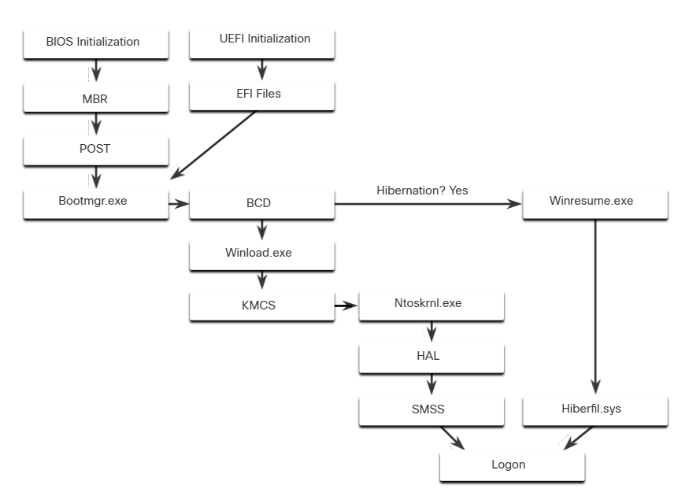

# Disk Operating System

Floppy ve hard diskler, depoladıkları verileri okumak, yazmak ve yönetmek için bir yazılıma ihtiyaç duyarlar. Disk Operating System (DOS) bu işlevi sağlayan bir sistemdir. DOS aynı zamanda, dosyaların düzenlenmesine olanak tanıyan bir file system sağlar.

Microsoft DOS'u satın alarak, MS-DOS'u geliştirdi. MS-DOS, insanların programlar oluşturması ve veri dosyalarını yönetmesi için arayüz olarak bir komut satırı kullandı.

MS-DOS ile birlikte, bilgisayar diski nasıl okuyacağını ve işletim sistemi dosyalarını doğrudan diskten yüklemeyi temel seviyede biliyordu. Bu işlem, bilgisayarın açılış (boot) sürecinin bir parçasıydı. MS-DOS yüklendiğinde, diske kolayca erişebiliyordu çünkü disk erişimi doğrudan işletim sisteminin içine gömülüydü.

Windows'un erken sürümleri, bir Grafik Kullanıcı Arayüzü (GUI) içeriyordu ve MS-DOS üzerinde çalışıyordu. Bu süreç, 1985 yılında Windows 1.0 ile başladı. Bu dönemde, bilgisayar ve donanımının kontrolü hâlâ disk tabanlı işletim sistemi (MS-DOS) tarafından sağlanıyordu. Ancak Windows 10 gibi modern işletim sistemleri artık disk işletim sistemi olarak kabul edilmiyor. Windows 10, "New Technologies" anlamına gelen Windows NT temeli üzerine kuruludur.
NT tabanlı işletim sistemlerinde, işletim sistemi doğrudan bilgisayarı ve donanımı kontrol eder. NT aynı zamanda çok kullanıcılı işlemleri destekler, bu da yalnızca tek işlem ve tek kullanıcı destekleyen eski MS-DOS'tan çok daha farklı bir yapıdır.

Günümüzde MS-DOS komutlarına windows işletim sisteminin bir parçası olarak cmd üzerinden ulaşılabilir.

# Windows Versions

1993'ten bu yana, NT tabanlı işletim sistemlerine dayalı 20'den fazla Windows sürümü yayımlandı. Bu sürümlerin çoğu, NT işletim sisteminin dosya sistemi tarafından sağlanan dosya güvenliği nedeniyle hem genel halkın hem de işletmelerin kullanımına sunuldu. İşletmeler de NT tabanlı Windows işletim sistemlerini benimsedi. Çünkü birçok sürüm, iş istasyonları, profesyonel sistemler, sunucular, gelişmiş sunucular ve veri merkezi sunucuları gibi özel amaçlar için özel olarak oluşturuldu.

Windows XP ile birlikte, ilk kez 64 bit sürüm sunuldu. 64-bit işletim sistemi tamamen yeni bir mimariydi. 32-bit adresleme yerine 64-bit adres alanı kullanıyordu. Ancak bu, sadece iki kat daha fazla alan anlamına gelmiyordu çünkü bu bitler ikili (binary) sayılarla çalışır.
32-bit Windows yaklaşık 4 GB RAM adresleyebilirken, 64-bit Windows teorik olarak 16.8 milyon terabayt adresleyebilir.
İşletim sistemi ve donanım 64-bit çalışmayı desteklediğinde, çok büyük veri setleri kullanılabilir.
Bu büyük veri setleri, devasa veritabanlarını, bilimsel hesaplamaları ve özel efektlerle yüksek çözünürlüklü dijital video işlemlerini kapsar.
Genel kural olarak, 64-bit bilgisayarlar ve işletim sistemleri, eski 32-bit programlarla geriye dönük uyumludur,
ancak 64-bit programlar, eski 32-bit donanımlarda çalıştırılamaz.

# Operating System Vulnerabilities

Varsayılan olarak, Windows kötü amaçlı yazılım koruması için Windows Defender'ı kullanır. Windows Defender, sisteme yerleşik bir koruma araçları paketi sağlar. Windows Defender kapatılırsa, sistem saldırılara ve kötü amaçlı yazılımlara karşı daha savunmasız hale gelir.

İşletim sisteminde arka planda çalışan birçok hizmet vardır. Her hizmetin tanımlanabilir ve güvenli olduğundan emin olmak önemlidir. Arka planda bilinmeyen bir hizmet çalıştığında, bilgisayar saldırıya karşı savunmasız olabilir.

Veriler şifrelenmediğinde kolayca toplanabilir ve istismar edilebilir. Bu sadece masaüstü bilgisayarlar için değil, özellikle mobil cihazlar için önemlidir.

İyi bir güvenlik politikası yapılandırılmalı ve takip edilmelidir. Windows Güvenlik Politikası denetimindeki birçok ayar saldırıları önleyebilir.

Varsayılan olarak Windows, ağdaki cihazlarla iletişimi sınırlamak için Windows Firewall'u kullanır. Zamanla, kurallar artık geçerli olmayabilir. Örneğin, artık kolayca erişilebilir olmaması gereken bir bağlantı noktası açık bırakılabilir.
Kuralların hala geçerli olduğundan emin olmak ve artık geçerli olmayanları kaldırmak için güvenlik duvarı ayarlarını düzenli olarak gözden geçirmek önemlidir.

Dosya ve paylaşma izinleri doğru şekilde ayarlanmalıdır. “Herkes” grubuna Tam Kontrol vermek kolaydır, ancak bu tüm kişilerin tüm dosyalara istediklerini yapmalarına olanak tanır. Her kullanıcıya veya gruba tüm dosyalar ve klasörler için gereken minimum izinleri sağlamak en iyisidir.

Birçok kişi zayıf parolalar seçer veya hiç parola kullanmaz. Tüm hesapların, özellikle admin hesabının çok güçlü bir parolaya sahip olduğundan emin olmak önemlidir.

Bir kullanıcı yönetici olarak oturum açtığında, çalıştırdığı herhangi bir program o hesabın ayrıcalıklarına sahip olacaktır.
Standart Kullanıcı olarak oturum açmak ve yalnızca belirli görevleri gerçekleştirmek için yönetici parolasını kullanmak en iyisidir. Yani admin yetkisiyle bir programı açarsanız, o programa admin yetkisi vermiş olursunuz. Bu yüzden, sadece gerekli komutları veya programları, gerektiğinde admin yetkisiyle çalıştırmak en doğrusu olacaktır.

# Windows Architecture and Operations

## Hardware Abstraction Layer

Windows bilgisayarlarda pek çok farklı donanım türü kullanılır. İşletim sistemi kurulurken donanım farklılıklarından izole edilmesi gerekir. Donanım farklılıklarının izole edilmesi şu anlama gelir; örneğin işlemciniz AMD ama ekran kartınız NVIDIA olsa bile ikisinin birlikte uyumlu çalışması sağlanmalıdır. Ama işletim sistemi, her bilgisayarda sıfırdan donanımı öğrenip değişmekle uğraşmaz. Bunun yerine, işletim sistemi donanımdan izole çalışacak şekilde tasarlanır. Yani doğrudan donanıma bağlı kod yazılmaz. İşletim sistemi, donanım sürücüleri (drivers) veya soyutlama katmanları (HAL - Hardware Abstraction Layer) kullanarak çalışır.

Hardware Abstraction Layer (HAL) donanım ve kernel arasındaki tüm iletişimi yöneten bir yazılımdır. Kernel ise, işletim sisteminin çekirdeğidir (core) ve tüm bilgisayar üzerinde kontrole sahiptir. Tüm input ve output isteklerini, belleği ve bilgisayara bağlı tüm çevre birimlerini yönetir. Kernel, bu kadar kapsamlı çalışmasına rağmen bazı durumlarda hala donanımla doğrudan iletişim kurar, bu nedenle HAL'den tamamen bağımsız değildir. HAL'in bazı işlevleri gerçekleştirmek için kernel'a ihtiyacı vardır.

## User Mode and Kernel Mode

Bilgisayarda Windows yüklü olduğunda CPU'nun çalıştığı iki farklı mod vardır: User Mode ve Kernel Mode. Kısaca, yüklenen uygulamalar user modunda, işletim sistemi kodu ise kernel modunda çalışır. İşletim sistemlerinin iki farklı modda çalışmasının sebepleri; güvenlik, kararlılık (stability), kontrol ve performanstır. Bunları daha yakından incelemek gerekirse:

#### Security -> Eğer her uygulama donanıma doğrudan erişebilseydi (yani kernel modda çalışsaydı), kötü niyetli bir uygulama tüm sistemi bozabilirdi. Bunun yanında user modda çalışan uygulamalar sınırlı yetkilere sahiptir.

#### Stability -> Kernel Mode sadece güvenilen, işletim sisteminin kendi kodları için kullanılır. Bir User Mode program (mesela bir oyun veya tarayıcı) çökse bile, kernel etkilenmez, yani tüm sistem çökmez.

#### Kontrol ve Performans -> Kernel, sistemi yönetir ve kaynakları (CPU, bellek, disk, ağ vs.) User Mode uygulamaları arasında dengeli şekilde dağıtır.

##### NOT: Sadece Windows değil tüm modern işletim sistemleri burada gördüğümüz 2 farklı mod ile çalışır.

İşletim sistemi ile bir aygıtın iletişim kurmasını sağlayan yazılım parçaları olan cihaz driverları, drivera bağlı olarak kernel veya user modunda çalışabilir.

Kernel modunda çalışan tüm kodlar aynı adres alanını kullanır. Adres alanı (Address Space), bir programın (veya bir kodun) kullanabileceği bellek bölgesidir. Bir uygulama çalıştığında, işletim sistemi ona bir hayali bellek haritası (memory map) oluşturur. Bu program sadece kendi adres alanı içinde çalışır, başka bir programın belleğine müdahale edemez ve bununla beraber, o programın çökmesinden diğer uygulamalar ve sistem etkilenmez. Fakat ilk cümlede de dediğimiz gibi, kernel modunda çalışan tüm kodlar aynı adres alanını paylaşır. Bu yüzden de, bir kernel mod sürücüsü yanlış bir adrese veri yazarsa, başka bir kernel kodunun veya işletim sisteminin kendi verilerinin üstüne yazabilir ve bu da bütün sistemin çökmesiyle sonuçlanarak, hepimizin aşina olduğu mavi ekran yani BSOD (blue screen of death) hatasıyla sonuçlanabilir.

## Windows File Systems

"Dosya sistemi" dediğimiz şey, diskte verilerin nasıl düzenlendiği ve yönetildiğidir.

### exFAT (Extended File Allocation Table)

FAT, adresleyebileceği bölüm (partition) sayısı, bölüm boyutları ve dosya boyutları açısından sınırlamalara sahip olduğundan, artık genellikle sabit diskler (HD'ler) veya katı hal sürücüler (SSD'ler) için kullanılmamaktadır. FAT'in, FAT16 ve FAT32 şeklinde iki farklı sürümü vardır. Ancak FAT32, FAT16'ya göre çok daha az kısıtlamaya sahip olduğundan en yaygın olanıdır.

exFAT ise, Microsoft tarafından geliştirilen, FAT32'nin daha da modernleştirilmiş halidir ve aynı zamanda farklı işletim sistemleri tarafından da desteklenir. 

### Hierarchical File System Plus (HFS+)

Bu dosya sistemi MAC OS X bilgisayarlarda kullanılır ve önceki dosya sistemlerine göre çok daha uzun dosya adlarına, dosya boyutlarına ve bölüm boyutlarına izin verir. Windows tarafından özel bir yazılım olmadan desteklenmese de, Windows HFS+ bölümlerinden veri okuyabilir.

### Extended File System (EXT)

Bu dosya sistemi Linux tabanlı bilgisayarlarda kullanılır. Windows tarafından desteklenmese de, Windows özel yazılımla EXT bölümlerinden veri okuyabilir.

### New Technology File System (NTFS)

Bu, Windows kurulumu sırasında en sık kullanılan dosya sistemidir. Windows ve Linux'un tüm sürümleri NTFS'yi destekler.
Mac-OS X bilgisayarlar yalnızca bir NTFS bölümünü okuyabilir. Özel sürücüler yüklendikten sonra bir NTFS bölümüne yazabilirler.

NTFS, Windows için en yaygın kullanılan dosya sistemidir ve bunun birçok nedeni vardır:

• NTFS, çok büyük dosya ve çok büyük disk bölümlerini destekler.

• Ayrıca diğer işletim sistemleriyle de yüksek uyumluluğa sahiptir.

• Oldukça güvenilirdir ve veri kurtarma (recovery) özelliklerini destekler.

En önemli özelliği ise, güçlü güvenlik özelliklerine sahip olmasıdır:

Veri erişim kontrolü, dosya başına uygulanan güvenlik tanımlayıcıları (security descriptors) sayesinde sağlanır. Bu güvenlik tanımlayıcıları, dosya sahibini ve dosya üzerinde kimlerin hangi yetkilere sahip olduğunu içerir. Yani dosya seviyesine kadar ayrıntılı izin ve sahiplik bilgisi tanımlanabilir.

NTFS ayrıca dosyalar üzerinde birçok zaman damgası (timestamp) kaydeder:

Bu damgalar dosya veya klasörün Değiştirilme (Modify), Erişim (Access), Oluşturulma (Create) ve Girdi Değiştirilme (Entry Modified) zamanlarını içerir. Bu zaman damgalarına genellikle "MACE" kısaltmasıyla atıfta bulunulur. Adli bilişim (forensics) çalışmalarında bir dosyanın geçmişini ve değişim tarihçesini anlamak için bu zaman damgaları çok önemlidir.

Son olarak, NTFS dosya sistemi düzeyinde şifreleme (file system encryption) de destekler. Bu özellik sayesinde tüm depolama ortamı (disk) güvence altına alınabilir.

Disk gibi bir depolama aygıtı kullanılmadan önce bir dosya sistemiyle biçimlendirilmelidir (formatlanmalıdır). Buna karşılık, bir depolama aygıtına bir dosya sistemi yerleştirilmeden önce de aygıtın bölümlere ayrılması gerekir. Bir sabit disk, "partition" adı verilen alanlara bölünür. Her partition, veri dosyaları veya uygulamalar gibi bilgileri depolamak için biçimlendirilebilen mantıksal bir depolama birimidir. Yükleme işlemi sırasında, çoğu işletim sistemi kullanılabilir sürücü alanını NTFS gibi bir dosya sistemiyle otomatik olarak bölümlere ayırır ve biçimlendirir.

NTFS formatting, dosya depolama, diskte önemli yapılar ve dosyaların konumlarını kaydetmek için tablolar oluşturur:

#### Partition Boot Sector

Disk bölümünün ilk 16 sektörüdür. Bu bölüm, Master File Table (MFT)'nin konumunu içerir. Ayrıca, disk üzerindeki son 16 sektör de, boot sektörünün bir kopyasını barındırır.

##### NOT: Partition Boot Sector'un kopyasını içeren son 16 sektör, partition'ın değil genel olarak diskin son 16 sektörüdür.

#### Master File Table (MFT)

Disk bölümündeki tüm dosya ve dizinlerin konumlarını tutan tablodur. Ayrıca dosyalarla ilgili güvenlik bilgileri ve zaman damgaları gibi dosya özelliklerini de içerir.

#### System Files

Diğer bölümler ve dosya özellikleri hakkında bilgi tutan gizli dosyalardır.

#### File Area 

Disk bölümünün ana bölgesidir. Dosyalar ve dizinler burada fiziksel olarak depolanır.

##### NOT: Bir bölümü (partition) biçimlendirirken, önceki veriler tamamen silinmediği için, eski veriler hâlâ kurtarılabilir durumda olabilir. Boş alan (free space) incelenerek dosyalar geri getirilebilir ve bu da güvenlik açısından risk oluşturabilir. Bu yüzden, yeniden kullanılacak bir sürücüye güvenli silme (secure wipe) işlemi yapılması önerilir. Secure wipe, sürücünün tamamına birden fazla kez veri yazarak, hiçbir eski verinin kurtarılamamasını sağlar.

### Alternate Data Streams (ADS)

NTFS, dosyaları bir dizi özellik (attribute) olarak saklar; bu özellikler dosyanın ismi, zaman damgaları gibi bilgileri içerir.
Dosyanın içerdiği asıl veri ise $DATA adlı bir özellikte tutulur ve buna veri akışı (data stream) denir. NTFS kullanarak bir dosyaya Alternatif Veri Akışları (ADS - Alternate Data Streams) da bağlayabilirsin. Bu özellik bazen, uygulamaların dosya hakkında ek bilgi depolaması için kullanılır. ADS, kötü amaçlı yazılım (malware) tartışmalarında önemli bir faktördür. Çünkü bir ADS içine veri saklamak oldukça kolaydır. Bir saldırgan, kötü amaçlı kodu bir dosyaya bağlı bir ADS içinde gizleyebilir
ve sonra bu kötü kodu başka bir dosya üzerinden çağırabilir.

NTFS dosya sisteminde, ADS'li bir dosya, dosya adından sonra iki nokta üst üste (:) işaretiyle belirtilir. Örneğin: 

Testfile.txt:ADS 

Bu, Testfile.txt dosyasına bağlı ADS adında bir alternatif veri akışı (ADS) olduğunu gösterir.

##### NOT: Adı ADS olmak zorunda değil, başka bir şey de olabilir. Yani "Dosya adı:Akış adı" şeklinde olduğu sürece istenilen bir şey olabilir. (Testfile.txt:Notlar vs.)

Yani ADS, NTFS dosya sisteminde bir dosyanın içine gizli ek veri katmanları koyabilmene yarayan bir özelliktir. Bir dosyanın görünürdeki içeriği değişmez, ama dosyaya görünmeyen bir ek akış (stream) bağlanır. Bu ek akışta istediğin başka bir veri saklayabilirsin: yazı, resim, hatta kötü amaçlı yazılım (malware) bile.

ADS günlük hayatta, dosyayı değiştirmeden, arka planda ek bilgi saklamak, güvenlik sistemleri ve uygulama verileri için kullanılır.

Eğer bir dosyada hangi ADS'ler var görmek istenirse, dir /r komutu kullanılır. Eğer belirli bir ADS'in içeriği görüntülenmek isterse, more < Testfile.txt:GizliNot kullanılabilir.

## Windows Boot Process

Bir bilgisayarın düğmesine basılmasıyla windowsun tamamen yüklenmesi arasındaki süreç "Windows Boot Process" olarak bilinir. Bu süreçte birden fazla işlem gerçekleşir.

İki farklı bilgisayar firmware'ini (BIOS ve UEFI) incelemeden önce, firmware nedir ona bakalım. Firmware en genel ve kısa tanımıyla, bir donanımın üzerinde çalışan, o donanımı kontrol eden gömülü yazılımdır. Birazdan bahsedeceğimiz BIOS ve UEFI, bir anakartı başlatan ana firmware'lerdir. Anakart haricinde diğer donanımların da kendine ait firmware'leri olabilir.

### Basic Input-Output System (BIOS)

BIOS 1980'lerin başlarında çıkan ve çıktığı günkü gibi de çalışmayı sürdüren, bilgisayarın en temel yazılımı, yani ilk çalışan yazılım katmanıdır. Bilgisayarı açtığında, daha işletim sistemi (Windows, Linux vs.) başlamadan önce, anakart üzerindeki BIOS devreye girer ve şunları yapar:

1- Donanımı başlatır ve kontrol eder (CPU, RAM, diskler, klavye, ekran kartı).

2- Sistem bileşenlerinin düzgün çalışıp çalışmadığını kontrol eder (POST yani Power-On Self Test yapar).

3- Bir önyükleme aygıtı (boot device) bulur ve işletim sistemini yükler (mesela harddiskten Windows'u başlatır).

4- Kullanıcıya BIOS ayar menüsü (Setup Utility) sunar (mesela saat ayarlamak, boot sırasını değiştirmek vs.).

Bilgisayarlar evrimleştikçe BIOS kullanıcılar tarafından talep edilen yeni özellikleri karşılayamaz oldu ve yerini UEFI'a bıraktı.

### Unified Extensible Firmware Interface

UEFI, temel işlev açısından BIOS ile aynı çalışır fakat BIOS'ta bulunmayan bir çok yeni özelliği destekler. Bu özellikler şu şekildedir:

| Özellik | BIOS | UEFI |
|:--------|:-----|:-----|
| Daha hızlı açılış | ❌ | ✅ BIOS'a göre daha hızlı boot olur. |
| Daha büyük disk desteği | ❌ (MBR ile 2 TB sınırı) | ✅ GPT ile 2 TB üzeri diskleri destekler. |
| Gelişmiş güvenlik | ❌ | ✅ Secure Boot ile kötü yazılımları önler. |
| Grafik arayüz | ❌ (sadece klavye, siyah ekran) | ✅ Mouse destekli renkli arayüz sunar. |
| Modüler yapı | ❌ | ✅ Üreticiler modüler şekilde kolayca ek özellik ekleyebilir. |

Şimdi bu iki firmware'in süreçlerini daha yakından inceleyelim:

BIOS firmware’ında süreç, BIOS başlatma (initialization) aşamasıyla başlar.
Bu aşamada donanım cihazları başlatılır ve donanımların düzgün çalışıp çalışmadığını, birbiriyle iletişim kurup kurmadığını kontrol etmek için bir Power-On Self-Test (POST) testi yapılır. Hatta eski bir bilgisayar kullandıysanız, bu aşamada bilgisayardan çeşitli "beep" şeklinde seslerin geldiğine şahit olmuş olabilirsiniz. Bu beep sesleri farklı hataları tanımlamaya olanak tanıyan ya da bir sorun olmadığına işaret eden seslerdir. Sistem diski keşfedildiğinde, POST aşaması sona erer. POST’taki son komut, Master Boot Record (MBR)'ı aramaktır.

MBR, işletim sistemini bulup yüklemekten sorumlu küçük bir program içerir. BIOS bu kodu çalıştırır ve işletim sisteminin yüklenme süreci başlar.

BIOS firmware’ına kıyasla, UEFI firmware açılış sürecine çok daha fazla hakimdir. UEFI, boot işlemini, diskteki özel bir bölüm olan EFI System Partition (ESP) içinde saklanan .efi uzantılı program dosyalarını yükleyerek gerçekleştirir. 

| Süreç | BIOS | UEFI |
|:------|:-----|:-----|
| POST | Geleneksel POST (beep kodları vs.) | Modern hızlı donanım testi (görünmeyebilir) |
| MBR | MBR aranır, boot kodu çalıştırılır | MBR kullanılmaz, EFI System Partition (ESP) aranır ve içindeki ilgili .efi dosyası çalıştırılır. |
| Önyükleme (Boot) | MBR içindeki küçük kodla OS başlar | .efi dosyası doğrudan çalıştırılır. |

#### NOT: Eski BIOS sistemlerinde boot kodu küçük bir parçaydı (MBR'deki boot kodu gibi), dışarıdan diske bağlıydı. UEFI kullanan bilgisayarlarda boot kodları anakartın firmware'ı içinde (ROM çipinde) saklanır. Bu, bilgisayarın doğrudan korumalı moda (protected mode) geçmesini sağlar ve bu da boot aşamasında bilgisayarın güvenliğini artırır. Yani bilgisayar açılır açılmaz dışarıdan (diskten) bir kod beklemeden kendi içindeki kodla güvenli bir şekilde açılış başlatabiliyor.

İster BIOS ister UEFI olsun, geçerli bir Windows kurulumu bulunduğunda, Bootmgr.exe dosyası çalıştırılır. Bootmgr.exe, sistemi real mode'dan protected mode'a geçirir, böylece sistem tüm belleği (RAM) kullanabilir hale gelir. Ardından Bootmgr.exe, Boot Configuration Database (BCD) adlı yapılandırma veritabanını okur. BCD, bilgisayarı başlatmak için gerekli ek kodları içerir. Ayrıca bilgisayarın hibernation (uyku modundan dönüş) mü yoksa soğuk başlangıç (cold start) mı yaptığını belirler.

Eğer bilgisayar hibernation modundan çıkıyorsa, boot süreci Winresume.exe ile devam eder. Bu aşamada bilgisayar, uyku modunda kaydedilen tüm sistem durumunun bulunduğu Hiberfil.sys dosyasını okur. Eğer bilgisayar cold start yapıyorsa, Winload.exe dosyası yüklenir. Winload.exe, donanım yapılandırmasının bir kaydını registry (kayıt defteri) içine oluşturur. Registry, bilgisayarın tüm ayarlarını, donanım ve yazılım bilgilerini saklayan bir veri tabanıdır.

Ayrıca Winload.exe, tüm sürücülerin dijital imzalarını doğrulamak için Kernel Mode Code Signing (KMCS) mekanizmasını kullanır.
Bu da sadece güvenli sürücülerin yüklenmesini sağlar. Sürücüler incelendikten sonra Winload.exe, Ntoskrnl.exe'yi çalıştırır.
Bu aşamada Windows çekirdeği (kernel) başlar ve Hardware Abstraction Layer (HAL) kurulmuş olur.

Son olarak, Session Manager Subsystem (SMSS) çalışır:

• Registry'yi okur,

• Kullanıcı ortamını (user environment) hazırlar,

• Winlogon servisini başlatır, (logon, "log on" yani oturum açmak kalıbından geliyor.)

• Ve kullanıcıların masaüstünü oturum açtıklarında hazırlamaya başlar.

## Windows Startup

Uygulamaları ve hizmetleri otomatik olarak başlatmak için kullanılan iki önemli registry öğesi vardır:

### HKEY_LOCAL_MACHINE

Burası, tüm bilgisayarın genel ayarlarını tutar.

Bilgisayarda kim oturum açarsa açsın, bu anahtarda kayıtlı olan servisler veya programlar kullanıcı farketmeksizin her açılışta çalışır. Örneğin, antivirüs servisi, donanım sürücüsü gibi şeyler buradan başlar.

### HKEY_CURRENT_USER 

Burası, şu anda oturum açmış olan kullanıcıya özel ayarları tutar. Sadece o kullanıcı oturum açtığında aktif olur. Örneğin, Spotify'ın sen oturum açar açmaz çalışması, Discord'un kendiliğinden açılması gibi kullanıcıya özel yazılımlar buradan yönetilir.

Bu kayıt defteri konumlarındaki farklı girdiler, girdi türlerine göre hangi hizmetlerin ve uygulamaların başlayacağını tanımlar. Bu türler arasında Run, RunOnce, RunServices, RunServicesOnce ve Userinit bulunur. Bu girdiler kayıt defterine elle girilebilir, ancak Msconfig.exe aracını kullanmak çok daha güvenlidir. Bu araç, bilgisayarın tüm başlatma seçeneklerini görüntülemek ve değiştirmek için kullanılır.

## Windows Shutdown

Bilgisayarı kapatmak için her zaman düzgün bir kapatma işlemi yapmak en iyisidir. Açık bırakılan dosyalar, sırasız kapatılan hizmetler ve askıda kalan uygulamalar, işletim sistemine önceden bilgi verilmeden güç kapatılırsa zarar görebilir. Bilgisayarın her uygulamayı kapatması, her hizmeti kapatması ve güç kesilmeden önce herhangi bir yapılandırma değişikliğini kaydetmesi için zamana ihtiyacı vardır.

Kapatma sırasında, bilgisayar önce user modu uygulamalarını, ardından kernel modu işlemlerini kapatır. Bir user modu işlemi belirli bir süre içinde yanıt vermezse, işletim sistemi bildirim görüntüler ve kullanıcının uygulamanın yanıt vermesini beklemesine veya işlemi zorla sonlandırmasına izin verir. Bir kernel modu işlemi yanıt vermezse, kapatma işlemi askıda kalmış gibi görünür ve bilgisayarı güç düğmesiyle kapatmak gerekebilir.

## Processes, Threads, and Services

Bir Windows uygulaması process'lerden (işlemler) oluşur. Uygulamaya adanmış bir veya birçok process olabilir. Bir process, şu anda yürütülmekte olan herhangi bir programdır. Çalışan her process en az bir thread'ten oluşur. Bir thread, yürütülebilen process'in bir parçasıdır. İşlemci, thread üzerinde hesaplamalar gerçekleştirir. 

Bir process'e ait tüm thread'ler, aynı adres alanı içinde bulunur. Bu da şu anlama gelir: Bir process'in thread'leri, başka bir process'in adres alanına erişemez. Bu koruma, bir process'in diğer process'lerin verilerini bozmasını (corruption) önler.

Windows, çoklu görev (multitasking) desteklediği için, aynı anda birden fazla thread çalıştırabilir. Ancak aynı anda çalıştırılabilecek thread sayısı, bilgisayarda bulunan işlemci (CPU) çekirdeği sayısına bağlıdır. Örneğin, 8 çekirdekli bir işlemci teknik olarak sadece 8 thread çalıştırabilir. Ama Windows (ve diğer modern işletim sistemleri) iş parçacıklarını sıraya sokup hızlıca değiştirerek (bu olaya context switching deniyor) çekirdeklerden çok daha fazla iş parçacığını "görünürde" aynı anda çalışıyormuş gibi gösterebilir. Mesela görünürde sanki 100 thread aynı anda çalışıyormuş gibi görülebilir ama teknik olarak sadece çekirdek sayısıyla sınırlıdır.

Windows'un çalıştırdığı bazı süreçler (processler) aslında servislerdir. Servisler, arka planda çalışan programlardır ve işletim sistemi ile uygulamaları desteklerler. Servisler, uzun süreli işlemler sağlar. Örnek olarak, Kablosuz ağ (Wi-Fi) bağlantısı, FTP sunucusuna erişim gibi hizmetler verilebilir.

## Memory Allocation and Handles

Bir bilgisayar, çalışmak için talimatları (komutları) RAM'de depolar ve ardından CPU bu talimatları işler. 

Bir işlemin (process) sanal adres alanı (virtual address space), o işlemin kullanabileceği sanal adreslerin kümesidir. Sanal adres, bellekteki gerçek fiziksel konumu göstermez; bunun yerine, sayfa tablosunda (page table) bir giriş olarak bulunur
ve bu giriş sayesinde sanal adres, fiziksel adrese çevrilir.

32-bit Windows bilgisayarlarda:

Her işlem için sanal adres alanı 4 gigabayt'a kadar adreslemeyi destekler.

64-bit Windows bilgisayarlarda:

Her işlem için sanal adres alanı 8 terabayt'tır.

Her kullanıcı alanı işlemi (user space process) kendi özel adres alanında çalışır, diğer kullanıcı işlemlerinden tamamen ayrı bir alana sahiptir. Eğer bir kullanıcı işlemi, kernel kaynaklarına erişmek isterse, bunu doğrudan yapamaz. Bunun yerine bir process handle (işlem tanıtıcısı) kullanır. Process handle, kullanıcı işleminin kernel kaynaklarına güvenli şekilde dolaylı yoldan erişmesine izin verir. 

Bellek tahsisini (memory allocation) görüntülemek için güçlü bir araç vardır: RAMMap.

RAMMap, Microsoft'un Windows Sysinternals Suite araç paketinin bir parçasıdır ve Microsoft’tan indirilebilir.

## The Windows Registry

Windows, donanım, uygulamalar, kullanıcılar ve sistem ayarlarıyla ilgili tüm bilgileri kayıt defteri (registry) adı verilen büyük bir veritabanında saklar.
Bu nesnelerin nasıl etkileşim kurduğu da kaydedilir; örneğin bir uygulamanın hangi dosyaları açtığı ve klasörler ile uygulamaların tüm özellik detayları gibi.

Kayıt defteri, hiyerarşik bir veritabanıdır:

- En üst seviye hive olarak adlandırılır,

- Hive'ların altında anahtarlar (keys) bulunur,

- Anahtarların altında ise alt anahtarlar (subkeys) vardır.

- Değerler (values), veri saklar ve anahtarlar ile alt anahtarların içinde bulunur.

Bir kayıt defteri anahtarı, en fazla 512 seviye derinliğe sahip olabilir.

### HKEY_CURRENT_USER (HKCU)

Şu anda oturum açmış olan kullanıcıya ait bilgileri tutar.

### HKEY_USERS (HKU)

Hosttaki tüm kullanıcı hesaplarına ait bilgileri tutar.

### HKEY_CLASSES_ROOT (HKCR)

Object Linking and Embedding (OLE) kayıtları hakkında bilgi tutar. OLE, farklı uygulamalardaki verileri, başka bir uygulamaya bağlamak (linking) veya gömerek yerleştirmek (embedding) için kullanılır.

Embedding (Gömme):

Başka bir uygulamadan bir nesneyi alıp, doğrudan kendi belgenin içine gömersin. Örneğin, Word dosyasına bir Excel tablosu ekliyorsun. Excel artık ayrı bir dosya değil, Word dosyasının içinde saklanıyor.

Linking (Bağlama):

Başka bir dosyaya bağlantı verilir ve ana dosyada değişiklik yapılırsa, bağlantılı belgede de değişiklik otomatik yansır. Örneğin, Word dosyasına bir Excel tablosu linkliyorsun. Excel dosyasını güncellersen, Word belgesindeki tablo da otomatik güncelleniyor. OLE'nin amacı, farklı uygulamalar arasında veri paylaşımını ve iç içe çalışma mantığını sağlamaktır.

### HKEY_LOCAL_MACHINE (HKLM)

Sistemle ilgili bilgileri tutar.

### HKEY_CURRENT_CONFIG (HKCC)

Mevcut donanım profili hakkında bilgi tutar.

Yeni hive'ler oluşturulamaz. Hive'lardaki kayıt defteri keyleri ve değerleri, yönetici ayrıcalıklarına sahip bir hesap tarafından oluşturulabilir, değiştirilebilir veya silinebilir. Kayıt defterini değiştirmek için regedit.exe aracı kullanılır. Bu aracı kullanırken çok dikkatli olunması gerekir. Kayıt defterinde yapılan küçük değişiklikler büyük veya hatta felaketle sonuçlanabilecek etkilere sahip olabilir.

Her bir key ve subkey aslında birer kapsayıcı (container) olduğu için, kayıt defteri yolu (path) dosya sistemi (folder yapısı) gibi temsil edilir. Ters eğik çizgi (\) kullanılarak hiyerarşi gösterilir.

Bir kayıt defteri anahtarı (registry key), ya alt anahtar (subkey) ya da değer (value) içerebilir.

Anahtarların içerebileceği farklı değer türleri şunlardır:

#### REG_BINARY -> Sayılar veya Boolean (true/false) değerler

#### REG_DWORD -> 32 bitten büyük sayılar veya ham veri (raw data)

#### REG_SZ -> Düz yazı (string) değerler

Kayıt defteri, işletim sisteminin ve kullanıcı bilgilerinin neredeyse tamamını içerdiği için,
kayıt defterinin tehlikeye atılmaması (bozulmaması veya kötüye kullanılmaması) kritik öneme sahiptir.

Kötü amaçlı yazılımlar (malicious applications), kendi kendilerini bilgisayar açılırken başlatmak için kayıt defterine anahtarlar ekleyebilirler. Normal bir açılış (boot) sırasında kullanıcı, bu programların başlatıldığını görmeyebilir. Çünkü giriş kayıt defterindedir ve uygulama bilgisayar açılırken pencere veya belirgin bir belirti göstermez. Bu yüzden, normal güvenlik taramaları (security audits) yaparken ya da enfekte olmuş bir sistemi temizlerken (remediation), kayıt defterindeki uygulama başlangıç noktaları mutlaka kontrol edilmelidir. Her öğenin güvenli ve tanıdık olduğundan emin olunmalıdır.

Kayıt defteri ayrıca:
kullanıcının günlük bilgisayar kullanımı sırasında yaptığı faaliyetleri de içerir.

Buna şunlar dahildir:

- Bilgisayara bağlanan tüm donanım cihazlarının geçmişi (cihaz adı, üretici bilgisi, seri numarası dahil),

- Kullanıcı ve programların açtığı belgeler,

- Bu belgelerin nerede bulunduğu,

- Ne zaman erişildiği gibi bilgiler.

Bu bilgiler, bir adli bilişim (forensics) soruşturması yapılması gerektiğinde son derece değerli kanıtlar sağlar.

